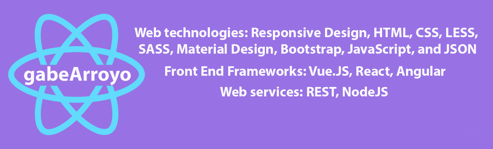

<h1 align="center">Hello I'm Gabe Arroyo</h1>

<!--
**https://github.com/gabearroyo1114** is a ✨ _special_ ✨ repository because its `README.md` (this file) appears on your GitHub profile.
Here are some ideas to get you started: -->

  
  
 
- 🔭 I’m currently working on `Deep Learning with Pytorch`
- 🌱 I’m currently learning `Differential Privacy`
- 💬 Ask me about anything, Except Maths :sweat_smile:
- 👨‍💻 Life Hack: Learn new tech :fire: and share what you have learned :tada:
- ⚡ Fun fact: I waste most of my time playing games
